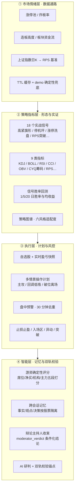
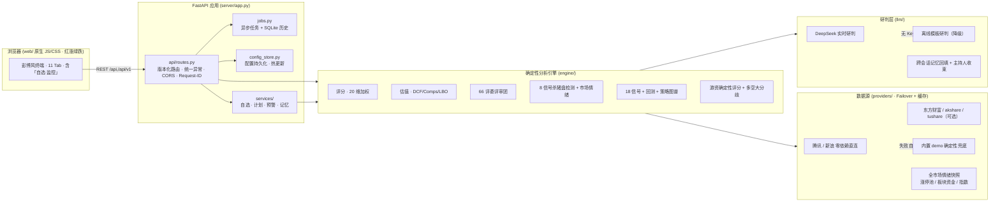

# AxiomDesk · 公理级投研终端

> 一个把 **UZI-Skill 个股深度分析方法论** 落地为可运行、可部署、可开源的投研终端，
> 并在其之上深度融合 **市场情绪 → 策略指标 → 执行计划 → 智能记忆** 四层工程能力。
>
> 实时 A 股 / 港股行情直连 + 66 位投资大师评审团 + 三模型估值 + 杀猪盘检测 + 游资确定性评分
> + 信号胜率回测 + 自选监控预警 + 跨会话记忆 + AI 研判层（DeepSeek 可选）+ 彭博风可视化前端。

[](LICENSE)
[](https://www.python.org)
[](.github/workflows/ci.yml)
[](.github/workflows/ci.yml)
[](.pre-commit-config.yaml)

---

## 🧭 四层能力矩阵



**四层一句话**：先看全市场温度（L1），再找个股形态与实证胜率（L2），
然后把结论变成可执行的自选 / 计划 / 预警（L3），最后用记忆与游资评分给 AI 研判加上确定性锚点（L4）。

---

## ✨ 特性

- **真实多源数据**：零依赖直连腾讯 / 新浪财经实时行情（无需安装重型库即可跑）；可选接入东方财富、akshare、efinance、tushare、baostock，失败自动降级到内置确定性 `demo` 数据，**应用永不崩**。
- **可配置数据源**：内置「数据源配置」页面，可视化启停 / 排序 / 超时 / 代理 / token，一键「测试连接」回传样本，保存即重建数据链路。
- **方法论忠实还原**：66 位投资大师（9 大流派）× 20 维加权评分、DCF / Comps / LBO 三模型估值、8 信号杀猪盘检测、多空大分歧辩论——均源自 [UZI-Skill](https://github.com/wbh604/UZI-Skill) 的公开方法论（见 `docs/METHODOLOGY.md`）。
- **全市场情绪快照**：涨停池 / 连板高度 / 炸板率 / 板块资金主线 / 上证指数，实时注入「情绪周期」信号与叙事层（离线自动合成，确定性可测）。
- **实证策略信号**：18 个实战形态信号（含 KDJ / BOLL / RSI / CCI / OBV / 筹码分布 CYQ / RPS 相对强度），每个信号附 1/5/20 日**历史胜率回测**，标注「实证可信 / 实证偏弱」。
- **游资专精分析**：龙虎榜席位 / 净买 / 机构 / 主力五段确定性打分（0~100），作为 AI 研判的「第二轨」校验锚点；游资派买入区间由 POC 与净买额真实计算。
- **执行层闭环**：自选股实时盈亏 → 多情景操作计划（入场区 / 止损 / 目标 / RR / 仓位）→ 盘中 5 类事件预警（30 分钟去重），配「自选·监控」前端面板。
- **跨会话记忆**：每只股票独立沉淀「事实 / 观点 / 决策」记忆（SQLite），下次分析自动回填给 AI 研判层，保持决策连续性。
- **AI 研判层**：接入真实 DeepSeek（OpenAI 兼容协议，零额外 SDK）；无 Key 时自动降级为离线「模板研判」，结论含数字引用与「但是」结构，并新增**辩论主持人收束**（条件化执行结论）。
- **彭博风终端**：原生 JS / CSS 前端（无构建步骤），红涨绿跌（中国习惯），11 个 Tab 全景呈现分析结论。
- **工程化就绪**：FastAPI 版本化 API（`/api` + `/api/v1`）、结构化日志与 Request-ID、异步任务 + SQLite 历史、横向对比、Docker / Compose / Makefile / CI。

---

## 🏗️ 架构



> 请求生命周期、数据契约与部署细节见 [docs/ARCHITECTURE.md](docs/ARCHITECTURE.md) 与 [docs/API.md](docs/API.md)。

---

## 🚀 快速开始

### 方式一：本地运行（推荐 Python 3.10+）

```bash
# 1. 安装依赖（仅 FastAPI/uvicorn/pydantic-settings；可选装 akshare 启用更多实时源）
#    开发模式（含 ruff/mypy/pytest 等质量门禁）：
pip install -e ".[dev]"
#    或仅运行时（等价于 requirements.txt）：
pip install -e .

# 2. 启动（默认 127.0.0.1:8137）
python -m uvicorn server.app:app --host 0.0.0.0 --port 8137
# 或： python -m server.app   /   axiomdesk

# 3. 打开浏览器
#    http://127.0.0.1:8137/
```

> 工程化：依赖与工具配置统一收敛于 `pyproject.toml`（含 `ruff` / `black` / `isort` / `mypy` / `pytest`）。
> 本地开发建议安装 pre-commit：`pre-commit install`（见 `.pre-commit-config.yaml`）。

### 方式二：Docker

```bash
docker compose up --build
# 访问 http://localhost:8137/
```

### 方式三：一键脚本

```bash
./start.sh        # macOS / Linux (Git Bash)
start.bat         # Windows 双击
```

启动后，进入「数据源配置」Tab 可查看 / 切换数据源、测试连接。

---

## ⚙️ 数据源配置

系统内置 7 个数据源接口，可在「数据源配置」页面或 `config.json` 中管理：

| 数据源 | 类型 | 默认 | 说明 |
|--------|------|------|------|
| `tencent`  | 零依赖直连 | ✅ 开 | `qt.gtimg.cn` 实时行情 + 前复权日K（动量/波动率） |
| `sina`     | 零依赖直连 | ✅ 开 | `hq.sinajs.cn` 实时行情 |
| `eastmoney`| 零依赖直连 | ❌ 关 | `push2.eastmoney.com`（部分网络环境受限） |
| `akshare`  | 可选包     | ❌ 关 | `pip install akshare` 后启用 |
| `efinance` | 可选包     | ❌ 关 | `pip install efinance` 后启用 |
| `tushare`  | 可选包     | ❌ 关 | 需 `token`（注册 tushare 获取） |
| `baostock` | 可选包     | ❌ 关 | `pip install baostock` 后启用 |

**数据模式（`data_source`）**：

- `demo`：纯离线确定性数据（内置 32 只近似个股 + 合成兜底），永不联网，适合 CI / 无网环境。
- `auto`：按「已启用 + 优先级升序」串成故障转移链（默认腾讯→新浪）。
- `<provider_id>`：强制指定单一真实源，不可用则降级 `demo`。

> 环境变量 `UZI_DATA_SOURCE` 可强制覆盖（便于容器注入 / 测试离线）。

### 数据溯源与基本面估算（诚实化设计）

为避免「假自信」的深度分析，系统对数据来源做透明标注：

- **行情实时**：腾讯/新浪返回真实 `现价 / PE / PB / 市值 / 动量 / 波动率`。
- **基本面派生**：当数据源未提供完整财报时（绝大多数 A 股默认如此），系统由实时 `PE/PB` **严格推导** `EPS = 现价/PE`、`BVPS = 现价/PB`、`ROE ≈ PB/PE`（TTM 恒等式），使 66 维评分与估值有真实锚点，而非跑在 0 值上。
- **溯源徽标**：每份报告头部标注 `live`（行情+基本面均实时）/ `estimated`（行情实时、基本面由 PE/PB 估算）/ `demo`（离线合成），并在基本面为估算/演示时给出醒目免责声明。

> 这意味着：任意有实时行情的 A 股都能得到**有意义且诚实**的分析；若需完整财报级基本面（营收/净利/FCF/负债等），请接入 `akshare` 等数据源。

---

## 🔌 API 概览

所有接口同时挂载于 `/api` 与 `/api/v1`。

| 方法 | 路径 | 说明 |
|------|------|------|
| GET  | `/api/health` | 健康检查（投资者数 / 流派数 / 维度数） |
| GET  | `/api/meta`   | 元信息（流派 / 投资者 / 维度 / 当前数据源） |
| GET  | `/api/analyze?ticker=600519&depth=deep&boost=0&use_ai=true` | 同步深度分析 |
| POST | `/api/jobs`   | 异步分析任务 |
| GET  | `/api/jobs/{id}` | 任务状态 + 结果 |
| GET  | `/api/history?ticker=600519` | 历史分析（SQLite） |
| GET  | `/api/compare?tickers=600519,300750&depth=medium` | 多标的横向对比（≤5） |
| GET/PUT | `/api/config` | 读取 / 更新数据源与 LLM 配置 |
| POST | `/api/config/test` | 测试某数据源连通性（回传样本） |
| POST | `/api/config/reset` | 恢复默认配置 |
| GET/POST | `/api/watchlist` · `/api/watchlist/{ticker}` | 自选股清单 / 增删（实时盈亏快照） |
| GET  | `/api/events?unacknowledged=true` · POST `/api/events/{id}/ack` · `/api/events/clear` | 盘中预警事件 / 确认 / 清空 |
| POST | `/api/monitor/check` | 触发一轮盘中预警检查（30 分钟去重） |
| GET/POST/DELETE | `/api/plans` · `/api/plans/{ticker}` | 多情景操作计划：查看 / 生成 / 删除 |
| GET/POST | `/api/memory/{ticker}` · `/summary` · `/rounds` | 跨会话记忆：召回 / 写入 / 摘要 / 轮次 |

完整请求 / 响应示例见 [docs/API.md](docs/API.md)。

---

## 🧪 测试

```bash
# 后端（pytest，强制离线 demo 模式，不污染仓库）
pytest -q

# 代码门禁（lint / format / type）
ruff check server/ tests/
ruff format --check server/ tests/
```

> 测试通过 `conftest.py` 在导入前设置 `UZI_DATA_SOURCE=demo` 与临时 `UZI_CONFIG`，保证确定性且不影响仓库 `config.json`。

---

## 🛡️ 质量保障

本项目以「可开源、可协作、可长期维护」为标准，内置多层质量门禁（CI 中强制执行）：

| 维度 | 工具 | 命令 | 要求 |
|------|------|------|------|
| 静态检查 | `ruff` (lint) | `ruff check server tests` | 0 error |
| 格式化 | `ruff` (format) | `ruff format --check server tests` | 全绿 |
| 类型 | `mypy` | `mypy server` | 0 error |
| 安全 | `bandit` | `bandit -r server -c .bandit` | 0 High/Medium |
| 测试 | `pytest` + 覆盖率 | `pytest --cov=server` | 全过，覆盖率 ≥ 70% |
| 前端 | `node --check` | `node --check web/app.js` | 语法通过 |

本地开发可一键对齐 CI：`make lint && make format && make type && make security && make test`，
或安装 `pre-commit`（`pre-commit install`）在提交前自动跑上述检查。

---

## 📖 文档

- [docs/ARCHITECTURE.md](docs/ARCHITECTURE.md) — 分层架构、请求生命周期、数据契约、部署
- [docs/METHODOLOGY.md](docs/METHODOLOGY.md) — 方法论溯源与保真度说明（含对 UZI-Skill 的署名）
- [docs/API.md](docs/API.md) — 完整 API 参考
- [CHANGELOG.md](CHANGELOG.md) — 版本与变更记录

---

## 🤝 贡献

欢迎 Issue / PR！请先阅读 [CONTRIBUTING.md](CONTRIBUTING.md) 与 [CODE_OF_CONDUCT.md](CODE_OF_CONDUCT.md)。

---

## ⚖️ 许可与署名

本项目以 **MIT License** 发布（见 [LICENSE](LICENSE)）。

其分析方法论（投资评审团、估值模型、陷阱信号、评分维度）**衍生自并受启发于**
[**UZI-Skill**](https://github.com/wbh604/UZI-Skill)（MIT，作者 **FloatFu-true**）。
本仓库为独立重新实现，未逐字并入 UZI-Skill 源码；同时融合了多个开源社区项目的工程思想
（市场情绪数据通路、筹码分布与 RPS 指标、自选监控与多情景计划、跨会话记忆、游资确定性评分等），
完整署名见 [NOTICE](NOTICE)。

---

## ⚠️ 免责声明

本工具仅用于研究与学习，**不构成任何投资建议**。所有实时数据来自第三方公开接口，
内置 `demo` 数据为确定性合成 / 近似值，**不代表真实行情**。投资决策请以其
他官方披露信息为准，风险自担。

---

## 🗺️ Roadmap

- [x] 多源数据通路（腾讯 / 新浪零依赖直连 + 可选包 + demo 兜底）
- [x] 全市场情绪快照（涨停池 / 板块资金 / 指数）
- [x] 指标补齐（KDJ / BOLL / RSI / CCI / OBV / CYQ / RPS）
- [x] 信号胜率回测 + 策略图谱
- [x] 自选股 / 操作计划 / 盘中预警
- [x] 跨会话记忆 + 游资确定性评分
- [ ] 财务数据真实化（接入财报接口补全营收 / 净利 / ROE 等）
- [ ] 报告导出（PDF / Markdown）
- [ ] 报告对比快照（同一标的跨日 diff）
- [ ] 英文界面
